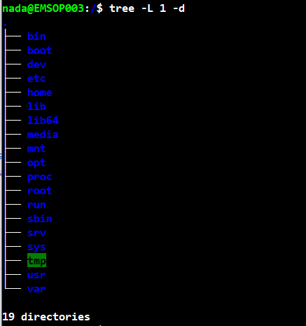

# Conceptos básicos de GNU/Linux

## FileSystem - Sistema de archivos

Es una estructura para ver, encontrar y utilizar ficheros, por otro lado el sistema de archivos abarca todos los archivos separados en esa estructura y sus formatos.

Sistema de archivos | Sistema Operativo | Descripción
------------ | ------------- | ---------------
FAT | Heredado | Este sistema fue adoptado universalmente. Se incluyó en 12 <b>FAT12</b>, 16 <b>FAT16</b> y 32 <b>FAT32</b>.
NTFS | Windows | Este sistema de archivos reemplazó a FAT en sistemas Windows. Todavía es necesario leer las particiones de Windows.
Ext2 | Linux | Segundo filesystem extendido, utilizado por muchas distribuciones Linux
Ext3 | Linux | Tercer filesystem extendido, es la opción predeterminada para Ubuntu. <b>Se agregó journaling</b>.
Ext4 | Linux | Cuarto filesystem extendido, usado en muchas distribuciones Linux. <b>Amplía los límites de almacenamiento</b>.
JFS | Linux | El sistema de archivos de journaling, introducido por IBM y compatible, pero sustituído por Ext4.
XFS | Linux/Irix | Opción de 64 bits más compatible, como una opción en Red Hat.
ReiserFS | Linux/SUSE | Era un formato de archivo que se usaba en varias distribuciones, pero en gran parte se ha sustituído por Ext3.

## Tipos de archivo en LINUX

<b>* Archivos regulares.</b> Contienen datos: archivos de texto, ejecutables o programas, entrada y salida de un programa y similares.

<b>* Directorios.</b> Son archivos/carpetas que corresponden a listas de otros archivos.

<b>* Archivos especiales.</b> Este es el mecanismo utilizado para la entrada y la salida. La mayoría de los archivos de este tipo estan en /dev

<b>* Vínculo.</b> Se trata de un sistema para hacer visible un archivo o directorio en varias partes del árbol de archivos del sistema.

<b>* Sockets de dominio.</b> Tipo de archivo especial que es similar a los sockets TCP/IP en Windows. Proporciona redes entre procesos protegidas por el control de acceso del sistema de archivos.

<b>* Tuberías nombradas.</b> Actúan similar a los sockets y son una manera para que los procesos se comuniquen entre sí, sin utilizar protocolos de socket de red.

<b>Estructura de archivos.</b> Esta estructura es que su <b>/</b> partición, debe ser primaria, mientras que cada otra partición, <b>ya sea primaria o lógica</b> debe montarse a esa partición. Cada partición tendrá un formato de archivo que se configurará y un propósito dentro del SO. Los directorios y archivos se pueden buscar y utilizar dentro de esta estructura.

## Particiones

Es distinto a la forma en conocemos una partición Windows. En Windows, las particiones son de dos tipos: <b>primario</b> y <b>lógico</b>. En un disco SATA IDE más antiguo, estará limitado a 4 particiones primarias o una combinación de varias particiones primarias y lógicas. Cada uno recibe una letra de unidad, pero podrá instalar el sistema en una partición primaria. Actualmente existen tablas GUID/GTP en lugar de MBR que permiten mayores tamaños de disco duro.

En Linux, las particiones también pueden ser <b>primarias</b> y <b>lógicas</b>. Sigue limitado a 4 particiones primarias o una combinación de particiones. Sin embargo, cuenta con las siguientes característiacas:

* Su primera partición será siempre la partición de instalación en una partición primaria.
* Ésta partición a veces se llamará la <b>raíz de la partición</b> o se mostrará como <b>/</b> y, será la partición más importante.
* Se pueden crear más particiones y darles tamaño, formato y propósito, pero normalmente se montarán en el <b>/</b> de esta partición para que realmente funcionen.

## Identificar particiones

A continuación, una tabla comparativa entre particiones Windows y Linux, así como la forma de identificarlas.

<b>Windows</b>


 HD                         | Partición Windows | Identificador Windows  
----------------------------|-------------------|-----------------------
 Primer HD IDE, SCSI, SATA  |  Primera partición| C:                    
 Primer HD IDE, SCSI, SATA  | Segunda partición | D:                    
 Segundo HD, IDE, SCSI, SATA| Primera partición | E:                    
 Segundo HD IDE, SCSI, SATA | Segunda partición | F:                    


<b>Linux</b>


| HD                         | Partición Linux   | Identificador Linux   |
|----------------------------|-------------------|-----------------------|
| Primer HD IDE    (hda)     | Primera partición | hda1                  |
| Primer HD IDE    (hda)     | Segunda partición | hda2                  |
| Primer HD IDE    (hda)     | Primera partición lógica de una extendida 1er disco IDE | hda5       |
| Segundo HD IDE   (hdb)     | Primera partición | hdb1                |
| Segundo HD IDE   (hdb)     | Segunda partición | hdb2                |
| Segundo HD IDE   (hdb)     | Primera partición lógica de una extendida 2do disco IDE | hdb5          |                     
| HD SCSI o SATA   (sda)     | Primera partición | sda1                |
| HD SCSI o SATA   (sda)     | Segunda partición | sda2                | 
| HD SCSI o SATA   (sda)     | Primera partición lógica del 1er disco SCSI | sda5        |
| SCSI             (sdb)     | Segundo disco SCSI/ primera, segunda, lógica| sdb1, sdb2, sdb5        |

Para la instalación de Linux, ya sea de la distribución que sea, se necesita como mínimo dos particiones: la principal, donde se instalará el sistema operativo, formateada con el sistema de archivos que permita la distribución que vayamos a instalar y otra partición llamada swap (intercambio de memoria virtual), esta partición es utilizada como memoria RAM virtual cuando tenemos muchas aplicaciones abiertas y la memoria RAM de nuestro ordenador es insuficiente, de tamaño del swap se suele poner el doble de la memoria RAM, es decir, si tenemos 250 Mb de memoria RAM el tamaño del swap debería de ser aproximadamente de 500 MB, pero estas cifras están pensadas para equipos con poca memoria. Por ejemplo, si te has comprado un equipo nuevo con 4GB de memoria RAM, no es obligatorio que ponga 8GB para el swap. También hay que considerar que si instalas Linux en un equipo con poca memoria y haces mucho uso del swap, tu ordenador se volverá más lento ya que se tarda más tiempo en leer y escribir del disco duro que de la memoria física RAM, en este caso deberías reconsiderar el ampliar la memoria RAM de tu ordenador. 

## Ingreso al sistema

Cuando ingresamos a un sistema de Linux sin interfaz gráfica, veremos el siguiente indicador en pantalla:

```
servidor login:
```

Tenemos que introducir nuestro nombre de usuario y contraseña (éste ultimo no será visible en la terminal ni aparecerá censurado).

```
servidor login:
Password:            // en esta parte ingresamos nuestra contraseña, en caso de ser incorrecta, la consola nos lo hará saber
```
## Consolas virtuales

La consola o terminal, está formada por el monitor y teclado conectados directamente a la computadora. GNU/Linux permite acceder a consolas virtuales (VC, "Virtual Console"), que nos permitirán tener más de unasesión activa a la vez desde una única consola física.

Para poder activar una nueva consola usaremos la combinación de teclas ALT+F2. Con ello debemos ver una nueva pantalla de Login. Para volver a la primer VC, presionamos ALT+F1.

Un sistema GNU/Linux de inicio permite acceder a las primeras seis VC, usando ALT+F1, F2, F3..., pero es posible habilitar hasta 12 VC, una por cada tecla de función en el teclado.

Esta es una de las características multiusuario del sistema. Mientras trabajamos con alguna VC, podemos conmutar a la VC2 y ejecutar diversas tareas entre cada VC.

## Intérprete de comandos

Es conocido también como Shell, nos permite tomar la entrada del usuario (órdenes que teclea) y las traduce en instrucciones del sistema operativo. El intérprete es una de las interfaces con Unix, sin embargo hay otras posibles, como la interfaz gráfica X Windows, GNOME, entre otros, que permite el uso de ratón y teclado.

Una orden será una acción que vamos a ejecutar. Cuando se tecla una orden, el intérprete hace varias cosas, primero busca el nombre del comando y comprueba si es un comando interno (un comando que el propio interprete sabe ejecutar por si miusmo). El intérprete también comprueba si el comando es un "alias" o nombre de sustituto de otro comando, en caso de no cumplir con cualquiera de estas condiciones, el intérprete busca el programa y lo ejecuta pasando argumentos especificados en la línea de comandos.

Ejemplo:

```
$ cat documento.txt
```
Ejecuta una orden por medio del comando <b>cat</b>, el cual nos sirve en este caso, para consultar el contenido del archivo de texto "documento.txt"

## Salir del sistema

Para salir del sistema o cerrar la sesión, solo usaremos el comando <b>exit</b>.

```
/home/user$ exit
```
## Cambiar la contraseña

La primera vez que ingresamos al sistema, usaremos la contraseña asignada por el administrador, sin embargo es recomendable cambiarla de inmediato. Para ello ocupamos el comando <b>passwd</b>, el cual pedirá la contraseña actual y luego la nueva (validando dos veces la nueva contraseña). En caso de olvidar la nueva contraseña, el administrador deberá modificarla por nosotros.

## Archivos y directorios

Un archivo o fichero, es el conjunto de información al que se le ha asignado un nombre. Puede ser un correo, un programa, un texto, etc., cualquier cosa almacenada en el disco que se guardará como un archivo individual.

<b>Buena práctica al nombrar los ficheros: Utilizar letras minúsculas, sin acentos.</b>

En general los archivos no estan limitados en la forma de nombrarse, pueden contener cualquier caracter con excepción de <b>"/"</b>, con un máximo de 256 caracteres de longitud.

Un directorio es un contenedor. Puede ser considerado como "carpeta" con muchos archivos distintos. Cuentan con un nombre que los identifica y forma una estructura de árbol, donde pueden contener a otros directorios.

## Árbol de directorios

En Linux, todo es un fichero, para ello existen directorios que nos referencían la clase de fichero que es. La mayoría de los sistemas Unix/Linux tienen una distribución de archivos estándar, de forma que los recursos y archivos puedan ser fácilmente localizados. Esta distribución forma el árbol de directorios, el cual comienza en el directorio “/”, también conocido como “raíz” o “root”.

No debemos confundir el directorio “root” o “raíz” con el usuario “root” que es el administrador del sistema, ni con el directorio “home” de éste último, ubicado en “/root”. 

Directamente por debajo (dentro) de / hay algunos subdirectorios importantes: /bin, /etc, /dev y /usr, entre otros. Estos a su vez contienen otros directorios con archivos de configuración del sistema, programas, etc.
En particular, cada usuario tiene un directorio “home”. Este es el directorio en el que el usuario guardará sus archivos.

La siguiente figura muestra un árbol de directorio de ejemplo.

```

/ ___ bin
|____ dev
|____ etc
|____ home ___ carlos
|        |____ diego ___ Mail 
|                  |____ articulos ___ notas
|                  |____ cartas
|____ lib
|____ proc
|____ tmp
|____ usr ___ X11R6
        |____ bin
        |____ lib
        |____ local ___ bin
        |         |____ etc
        |____ man
        |____ src ___ linux
        |____ tmp 
```

Para poder inspeccionar los directorios de tu distribución puedes instalar el programa "tree", el cual listará en directorios de forma recursiva. Será el primer programa que instalaremos.

Desde CentOS, Fedora o RHEL, usarás el comando YUM, en cambio para distribuciones Debian, Ubuntu, Mint, usarás APT-GET, de la siguiente manera:

<b>1) CentOS, Fedora, RHEL</b>
```
$ sudo yum install tree
```
<b>2) Debian, Ubuntu, Mint</b>
```
$ sudo apt-get install tree
```
Una vez realizada la instalación, podemos usar algunos comandos básicos:

```
$ tree -a // Listar todos los ficheros, incluídos los ocultos
$ tree -d // Listar solo directorios
$ tree -l // Listar siguiendo los links simbólicos como si fueran directorios
```
Ejemplo:
```
$ tree -L 1 -d   // Esto quiere decir que listaremos un solo NIVEL del árbol (L1) y que solo muestre directorios (d).
```


## Directorio de trabajo

Las órdenes que damos al interprete de comandos, se dan desde el directorio actual de trabajo en que estamos ubicados. Cuando un usuario entra al sistema, su directorio actual de trabajo se inicia en su directorio "home" (/home/user).

Para invocar algún fichero (por ejemplo un archivo de texto), se puede usar la ruta relativa o absoluta, según sea el caso.
* Una ruta relativa, se refiere a aquella que se encuentra dentro del mismo directorio en su nivel y posterior al que nos encontramos.

* Una ruta absoluta, se refiere a aquella que se encuentra en un lugar distinto al directorio de trabajo actual, por lo que debemos indicar la ruta completa que se usará para llegar a el.

* En caso de la ruta relativa, Linux detecta si ésta empieza con un carácter distinto a "/", lo que significa que se refiere al archivo con su posición relativa a su directorio de trabajo.

* En caso de la ruta absoluta, Linux detecta que comienza con el caracter "/", así que interpreta que el camino completo al archivo será partiendo desde el directorio ráiz (/).


## Directorio Home

Bajo bash y tcsh, los cuales son los intérpretes de comandos más usados en Linux, el directorio "home" puede ser referenciado usando el caracter de la tílde "~", por ejemplo:

```
/home/user$ cat ~/directorio/fichero
```
Es semejante a:

```
/home/user$ cat /home/user/directorio/fichero
```
El caracter "~" es sustituido por el intérprete de comandos con el nombre del directorio "home". El uso de la tílde es un atajo; no existe un directorio llamado "~", sólo es una ayuda sintáctica proporcionada por el intérprete de comandos.

## Sistema de archivos virtual

El sistema de ficheros o archivos virtual de Linux, es una capa que utiliza el núcleo de Linux para abstraer y uniformizar el acceso a los diferentes tipos de sistemas de ficheros.

El un sistema de ficheros se distinguen tres estructuras de datos fundamentales: Superbloques, inodos y ficheros.

<b>* Superbloques.</b> Contienen datos escenciales de cada sistema de ficheros montado, así como los manejadores de entrada a dicho sistema de ficheros.

<b>* Inodos.</b> Contienen información sobre cada entrada de datos del sistema de ficheros, tipo, permiso, propietario, tamaño, fechas, punteros a los bloques de datos, etc.

<b>* Ficheros.</b> Son archivos que contienen una tabla de asociaciones nombre-inodo.
<b>* Directorios.</b> Son ficheros que contienen una tabla de asociaciones nombre-inodo.

Linux a diferencia de Windows, usa <b>un solo árbol de directorios</b> para todos los discos/particiones, y se llama <b>VFS: Virtual FileSystem</b>, o sistema de archivos virtual.

El VFS de Linux, se usa para mpas cosas que para almacenar archivos, tales como permitir el acceso a discos montados, dispositivos y archivos virtuales que no existen un un disco físico, pero son modelados como archivos.

Así, un solo sistema de archivos virtual, con un solo directorio raíz, sirve para acceder a los archivos almacenados en cualquier partición, puesto que el mecanismo de acceso está basado en el <b>montaje</b> de los sistemas de archivos "reales" en directorios o "<b>puntos de montaje</b>" dentro del sistema de archivos raíz.

El sistema de archivos raíz de un sistema Linux; la raíz de su sistema de archivos virtual, es el directorio "<b>/</b>" (slash). Para visualizar el listado de los directorios que lo conforman, podemos usar el comando <b>ls /</b>. Ejemplo:

```
user@server:~$ ls /

bin   etc         initrd.img.old  media  proc  sbin  tmp  vmlinuz
boot  home        lib             mnt    root  srv   usr  vmlinuz.old
dev   initrd.img  lost+found      opt    run   sys   var
```
Todos los archivos virtuales <b>no existen</b>, en ningún sistema de archivos real, puesto que se generan cuando inicia el sistema operativo, o cuando se conectan dispositivos en el momento.

## Directorios importantes de Linux

Tenemos los siguientes directorios imporantes del sistema de archivos, que encontrarás en cualquier distribución Linux.

|Directorio           | Contenido                                                                                                      |
|---------------------|----------------------------------------------------------------------------------------------------------------|
|<b> /bin</b>         | Aplicaciones binarias importantes.                                                                             |
|<b> /boot</b>        | Ficheros de configuración del arranque, núcleos y otros ficheros necesarios para el arranque (boot) del equipo.|
|<b> /dev</b>         | Los ficheros de dispositivos.                                                                                  |
|<b> /etc</b>         | Ficheros de configuración, scripts de arranque, etc.                                                           |
|<b> /home</b>        | Directorios personales (home) para los distintos usuarios.                                                     |
|<b> /initrd</b>      | Usado cuando se crea un proceso de arranque initrd personalizado.                                              |
|<b> /lib</b>         | Librerías del sistema (libraries).                                                                             |
|<b> /lost+found</b>  | proporciona un sistema de "perdido+encontrado" (lost+found) para los ficheros que existen debajo del directorio raíz <b>(/)</b>. |
|<b> /media</b>       | Particiones montadas (cargadas) automáticamente en el disco duro y medios (media) extraíbles como CDs, cámaras digitales, etc.       |
|<b> /mnt</b>         | Sistemas de archivos montados manualmente en el disco duro.                                                    |
|<b> /opt</b>         | Proporciona una ubicación donde instalar aplicaciones opcionales (de terceros)                                 |
|<b> /proc</b>        | Directorio dinámico especial que mantiene información sobre el estado del sistema, incluyendo los procesos actualmente en ejecución |
|<b> /root</b>        | Directorio personal del usuario root (superusuario); también llamado "barra-root". |
|<b> /sbin</b>        | Binarios importantes del sistema |
|<b> /srv</b>         | Puede contener archivos que se sirven a otros sistemas |
|<b> /sys</b>         | Archivos del sistema (system) |
|<b> /tmp</b>         | Archivos temporales |
|<b> /usr</b>         | Aplicaciones y archivos a los que puede acceder la mayoría de los usuarios |
|<b> /var</b>         | Archivos variables como archivos de registros, directorio para sitio web y bases de datos |


URL Fuentes:

https://smaldone.com.ar/documentos/misdocs/tutorial-gnu-linux
https://www.dell.com/support/article/mx/es/mxbsdt1/sln152018/explicaci%C3%B3n-sobre-los-tipos-y-definiciones-de-particiones-y-directorios-de-ubuntu-linux?lang=es
http://www.aquihayapuntes.com/particiones-y-sistemas-de-archivos-en-linux.html
http://es.tldp.org/Articulos-periodisticos/jantonio/vfs/vfs_2.html
https://juncotic.com/virtual-filesystem-linux/
https://help.ubuntu.com/kubuntu/desktopguide/es/directories-file-systems.html
